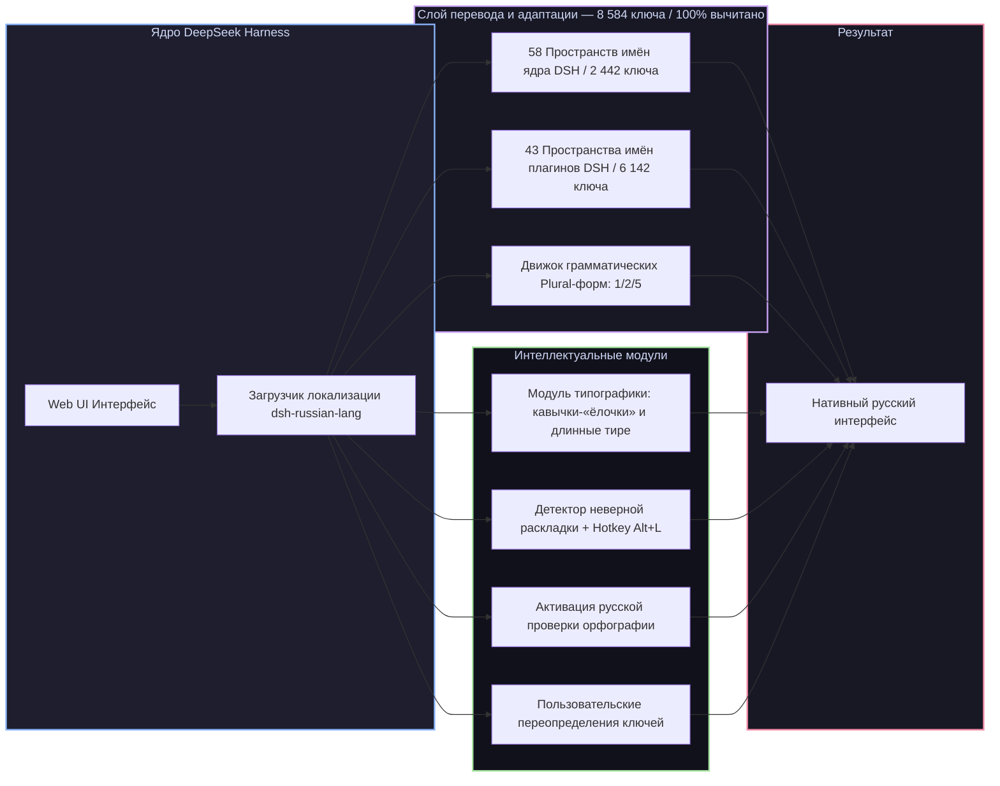

# 📦 @goodandready/dsh-russian-lang

<div align="center">

<h3>Полная русская локализация, умная типографика и исправление раскладки клавиатуры для DeepSeek Harness</h3>

<p align="center">
  <a href="https://www.npmjs.com/package/@goodandready/dsh-russian-lang"></a>
  <a href="LICENSE"></a>
  <a href="https://github.com/topics/dsh-plugin"></a>
  <a href="https://nodejs.org"></a>
</p>

<p align="center">
  
  
  
  
</p>

<p align="center">
  <a href="https://goodandready.app/"></a>
</p>

<p align="center">
  
</p>

<table align="center">
  <tr>
    <td align="center">
      ⭐ <strong>Если вам нравится этот плагин, поставьте ему звезду на GitHub</strong> — это покажет мне, что плагин вам полезен, и будет мотивировать меня развивать его дальше.
      <br><br>
      🐛 <strong>Если вы нашли баг или хотите предложить новый функционал</strong>, создайте issue на GitHub на любом языке — я рассмотрю ваше предложение и реализую полезные идеи в одной из следующих версий плагина.
    </td>
  </tr>
</table>

</div>

---

## ⚡ Обзор

**`dsh-russian-lang`** — официальный, всеобъемлющий пакет русской локализации для веб-интерфейса [DeepSeek Harness](https://github.com/deepseek-ai/deepseek-harness) (dsh).

Пакет не просто переводит интерфейс ядра и всех популярных плагинов экосистемы, но и добавляет интеллектуальные функции для комфортной русскоязычной работы: **100% ручная вычитка терминов**, **грамматические формы множественного числа (plural)**, автоматическую **расстановку экранной типографики** («ёлочки», длинные тире, неразрывные пробелы) и **исправление ошибочно набранного текста** на неверной раскладке по горячей клавише <kbd>Alt+L</kbd>.



---

## ✨ Полный обзор возможностей

### 1. 🌐 100% покрытие ядра DSH (58 пространств имён, 2 442 ключа)
* **Диалоги и переписка (`conversation`)**: лента сообщений, ветки обсуждений, карточки вызова инструментов, статус генерации и рассуждений (thinking traces).
* **Модели и провайдеры (`settings.models`)**: каталог моделей, параметры инференса, управление токенами и ключами API.
* **Трейсы рассуждений (`trajectory`)**: детальные шаги, параметры вызовов инструментов, временные метки и визуализация размышлений модели.
* **Настройки ядра (`settings`, `common`, `settings.theme`)**: параметры подключения, горячие клавиши, системные уведомления, масштабирование шрифтов, модальные окна и подтверждения.
* **Рабочие области (`workspace`, `subagent`)**: дерево файлов, управление контекстом, запуск и координация субагентов.
* **Планировщик и инвентарь (`schedule.catalog`, `settings.pluginInventory`, `settings.plugins`)**: фоновые задания, периодичность, фильтры и каталог установленных плагинов.
* **Права доступа и безопасность (`permission.access`, `plan`, `skill`)**: пресеты прав (полный доступ, только чтение, запись в рабочую область), выполнение планов и навыки.

> **О качестве перевода.** Все **8 584 ключа интерфейса (2 442 ядра + 6 142 плагинов) переведены на 100% и вычитаны вручную**. Черновой машинный перевод полностью замещён проверенными формулировками (`draft = 0`). Перевод регулярно валидируется автоматическими линтерами целостности плейсхолдеров, проверкой соблюдения глоссария (`glossary.json`) и детекторами переполнения верстки. Нашли неточность — кнопка «Сообщить о проблеме перевода» в карточке настроек создаёт готовый issue.

### 2. 🧩 Встроенный перевод 65+ плагинов экосистемы DSH (6 142 ключа)
Локализация автоматически распространяется на все ключевые плагины экосистемы DeepSeek Harness:
* **`dsh-session-control`** — расширенное управление сессиями: закрепление диалогов, архив по периодам, просмотр расшифровок и фильтрация шума;
* **`dsh-kanban` и `task-board`** — канбан-доски задач, карточки, чек-листы, дедлайны, критерии готовности (DoD) и шлюз приёмки (Acceptance Gate);
* **`dsh-cost-meter`** — учёт стоимости токенов, калькуляция расходов и тарифные сетки моделей в реальном времени;
* **`dsh-goal`** — автономный целеполагающий агент с безопасным циклом и рефлексией;
* **`dsh-moa`** — многоагентная архитектура Mixture-of-Agents;
* **`dsh-context-lens` и `dsh-context`** — визуализатор и оптимизатор контекста, аналитика токенов и сжатие;
* **`dsh-time-machine`** — снимки рабочей области и откат состояний файлов;
* **`dsh-shadow-auditor`** — теневой аудит изменений и безопасность;
* **`dsh-cron` и `schedule.catalog`** — планировщик периодических cron-задач;
* **`dsh-clinebot` и `im-hub`** — интеграции и шлюзы для Telegram, Discord, Slack;
* **`dsh-subscriptions`** — управление персональными подписками на модели;
* **`dsh-voice` и `dsh-tts`** — распознавание речи и голосовое озвучивание;
* **`dsh-image-gen`** — генерация изображений;
* **`dsh-lanmode`** — сетевой доступ по локальной сети и генерация TLS-сертификатов;
* **`dsh-model-sync`** — синхронизация моделей и эндпоинтов;
* **`dsh-usage-guard` и `token-dashboard`** — контроль лимитов и аналитика расходов токенов;
* **`skills-manager` и `dsh-skill-hub`** — менеджер навыков агента и витрина способностей;
* **`commandcode` и `settings.commandcode`** — провайдеры команд и аккаунты;
* **`better-sidebar`, `better-input`, `opencode-palette`, `context-doctor`, `plugin-store`, `autoReview`** и др.

### 3. 🔢 Русские грамматические формы числительных (Plural)
Английский язык различает только `1` и `other`. Русский язык требует 3 грамматические формы числительных (`1 файл`, `2 файла`, `5 файлов` / `1 секунда`, `3 секунды`, `10 секунд`). Движок локализации автоматически подставляет правильные окончания в зависимости от числового значения.

### 4. ✍️ Интеллектуальный модуль типографики (`russian-lang.typography`)
Автоматически приводит тексты сообщений и описаний к правилам русской экранной типографики:
* Заменяет прямые "лапки" на правильные кавычки-«ёлочки» (а вложенные — на „лапки“);
* Заменяет дефисы между словами на длинные тире (—);
* Добавляет неразрывные пробелы после коротких союзов и предлогов, предотвращая висячие строки;
* **Безопасность кода**: типографика строго изолирована и никогда не затрагивает блоки исходного кода, формулы LaTeX и моноширинные поля ввода.

### 5. ⌨️ Исправление ошибочной раскладки клавиатуры (<kbd>Alt+L</kbd>)
Если вы забыли переключить раскладку и набрали текст латиницей (например, `ghjtrn d gzkmt` вместо `проект в пальто`), плагин мгновенно:
* Определяет ошибочный ввод в реальном времени;
* Показывает ненавязчивую плавающую подсказку над полем ввода;
* При нажатии горячей клавиши <kbd>Alt+L</kbd> мгновенно конвертирует набранный текст в правильную кириллицу.

### 6. 🔍 Интерактивный Инспектор перевода и живые оверрайды (<kbd>Alt+Click</kbd> / <kbd>Alt+I</kbd>)
Мощный встроенный инструмент для инспекции строк интерфейса и мгновенного редактирования переводов на лету:
* **Точечная инспекция (<kbd>Alt+Click</kbd>)**: зажмите клавишу <kbd>Alt</kbd> и кликните по любому элементу интерфейса (кнопке, пункту меню, лейблу), чтобы открыть модальное окно инспектора.
* **Постоянный режим (<kbd>Alt+I</kbd>)**: переключает интерфейс в интерактивный режим исследования — наведение курсора подсвечивает элементы аккуратной рамкой с бейджем источника (`Core`, `Plugin`, `DOM`, `Untranslated`), а в правом нижнем углу экрана отображается плавающий статус-виджет с кнопкой быстрого выхода.
* **Модальное окно инспектора**:
  * Точное определение системного ключа, пространства имён и типа источника.
  * Быстрое копирование ключа или готового стандартизированного Markdown-сниппета для баг-репорта в 1 клик.
  * Поле ввода собственного перевода (оверрайда) с кнопкой **«Применить»**: мгновенно изменяет текст в DOM и сохраняет оверрайд в настройки (`russian-lang.overrides`) без перезагрузки страницы. Все аналогичные элементы интерфейса обновляются автоматически.
  * Кнопка **«Сбросить»** для мгновенного отката к стандартному словарному переводу.
* **Управление в карточке настроек (Раздел 4.5)**:
  * Кнопка быстрого включения/выключения инспектора (<kbd>Alt+I</kbd>).
  * Кнопки **«Экспорт JSON»** и **«Импорт JSON»** для резервного копирования, переноса и синхронизации списка ваших оверрайдов между браузерами и рабочими профилями.

### 7. ⚡ Оптимизации производительности и архитектурная безопасность
* **Пакетная обработка MutationObserver**: оптимизированный наблюдатель мутаций интерфейса с адаптивным debounce (16 мс) предотвращает лавинообразные перерисовки и перерасчёт макета (reflow) при интенсивном рендеринге списков и стриминге LLM-токенов.
* **Защита HTTP-маршрутов словарей (405 Method Not Allowed)**: серверные эндпоинты `/api/dsh-russian-lang/dict/core`, `/api/dsh-russian-lang/dict/plugins`, `/api/dsh-russian-lang/dict/all` строго защищены и принимают только безопасные методы GET/HEAD.
* **Клиентский бандл с запасом**: оптимизированная архитектура и компактный бутстрап обеспечивают размер клиентского скрипта 153.7 KiB (запас более 10 KiB до предельного лимита).

### 8. 🔤 Нативная интеграция в ядро
Плагин нативно регистрирует пункт **«Русский»** в меню **Настройки → Общие → Язык**, переключает атрибут `<html lang="ru-RU">` и активирует встроенный браузерный словарь проверки орфографии (`spellcheck`).

---

## 📦 Установка

```bash
dsh plugin --profile web add @goodandready/dsh-russian-lang
```

После установки откройте веб-интерфейс, перейдите в **Настройки → Общие → Язык**, выберите **«Русский»** и обновите страницу.

---

## ⚙️ Параметры конфигурации (`settings.yaml` / профиль Cordis)

В актуальных версиях DSH (v0.2.0-rc.2+, v0.1.7+) конфигурация плагина управляется штатно через managed-форму в веб-интерфейсе (**Настройки → Плагины → Русская локализация**) либо в профиле/конфиге под идентификатором плагина `dsh-russian-lang` (согласно `cordis.patch.yml`).

Для полной обратной совместимости с ранними версиями ядра (DSH <= 0.1.6) плагин также автоматически поддерживает чтение из легаси-пространства `russian-lang`.

Схема параметров объявлена в [`lib/index.js`](lib/index.js), все поля необязательные:

```yaml
# Актуальный формат (DSH v0.2.0-rc.2+ / v0.1.7+):
dsh-russian-lang:
  enabled: true                    # Русский язык интерфейса (по умолчанию: true)
  overrides: {}                    # Пользовательские оверрайды ключей (по умолчанию: {})
  typography:                      # Интеллектуальная типографика (по умолчанию: все opt-in false)
    enabled: false                 # Ёлочки, длинные тире, неразрывные пробелы
    yo: false                      # Восстановление безопасной буквы «ё»
    liveInput: false               # Живая типографика при вводе в текстовых полях
  agentPrompt: false               # Системная инструкция агенту отвечать по-русски (по умолчанию: false)
  agentPromptPreset: technical_expert # Пресет системного промпта (по умолчанию: technical_expert)
  slashAliases: true               # Русские алиасы слэш-команд (/помощь, /очистить) (по умолчанию: true)
  layoutConversion: true           # Детектор неверной раскладки и подсказка Alt+L (по умолчанию: true)
  quickSwitch: true                # Быстрый переключатель RU/EN в статусной строке (по умолчанию: true)
  translateEngine: off             # Движок перевода реплик: off, local (LibreTranslate) или google (Google) (по умолчанию: off)
  localApiUrl: http://localhost:5000 # URL локального инстанса LibreTranslate (по умолчанию: http://localhost:5000)

# Легаси-формат (DSH <= 0.1.6, поддерживается автоматически как fallback):
# russian-lang:
#   enabled: true
#   ...
```

Удобнее всего настраивать параметры визуально в интерфейсе: **Настройки → Плагины → Русская локализация**.

Исправление раскладки (<kbd>Alt+L</kbd>) и русские алиасы слэш-команд включены по умолчанию (`true`) и могут быть индивидуально отключены в настройках (`layoutConversion: false`, `slashAliases: false`). Браузерный спелчек (`lang="ru-RU"`) активируется автоматически при выборе русской локали.

---

## 🛠 Разработка и зеркало репозитория

Публичный репозиторий на GitHub является дистрибутивным зеркалом релизов `@goodandready/dsh-russian-lang`. Основная разработка, сборочный пайплайн и полный тестовый контур ведутся в основном Gitea-репозитории проекта.

Pull Requests и Issues на GitHub приветствуются и обрабатываются в обычном порядке! Для внесения правок в логику клиента используйте `lib/client.template.js`. Запуск `npm test` в репозитории выполняет полную проверку (270+ модульных тестов Node.js, тесты сборщика, линтеры переводов и глоссария).

---

## 📄 Лицензия

MIT © [GooDAnDReaDY](https://github.com/GooDAnDReaDY)


## Движок перевода реплик

Плагин позволяет переводить ответы модели на русский язык. Для этого используется один из двух движков — по выбору пользователя в настройках. **По умолчанию оба движка выключены** (`translateEngine: off`).

### Google Translate (неофициальный)

Текст ответов модели отправляется на `translate.googleapis.com/translate_a/single?client=gtx` — это **неофициальный** публичный эндпоинт Google без SLA и без гарантий доступности. В ответах модели могут содержаться фрагменты кода, пути, содержимое файлов — **всё это уходит третьей стороне**. При включении в карточке настроек отображается жёлтый бейдж.

### LibreTranslate (локальный)

Плагин запускает Docker-контейнер `libretranslate/libretranslate:v1.5.3` на `127.0.0.1:5000`. Перевод выполняется полностью локально — текст **не покидает машину**. Для работы необходим установленный Docker.

| Движок | Куда уходит текст | Приватность | Интернет |
|---|---|---|---|
| `off` (по умолчанию) | никуда | ✅ полная | не нужен |
| `google` | Google (googleapis.com) | ⚠️ текст отправляется третьей стороне | нужен |
| `libretranslate` | localhost:5000 (Docker) | ✅ локально | нужен только для загрузки образа |
